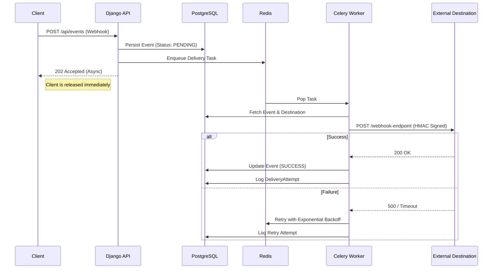

# Webhook Delivery System

A fault-tolerant, asynchronous webhook delivery platform designed to handle high-throughput event ingestion and reliable delivery to external destinations. Built with an emphasis on scalability, data integrity, and security.

## System Architecture

## Core Features

*   **Asynchronous Processing**: Decouples ingestion from delivery using Celery and Redis, ensuring sub-50ms API response times regardless of downstream latency.
*   **Reliable Delivery Engine**: Implements exponential backoff retry strategies (1m, 2m, 4m) to handle external service outages gracefully.
*   **Security**: authenticates payload integrity using HMAC-SHA256 signatures, preventing replay attacks and tampering.
*   **Observability**: Full audit logging of every delivery attempt, response code, and latency in a normalized PostgreSQL schema.
*   **Scalability**: Dockerized microservices architecture allowing independent scaling of ingestion handling (API) and delivery throughput (Workers).

## Tech Stack

*   **Backend**: Python, Django, Django REST Framework
*   **Async Task Queue**: Celery
*   **Message Broker**: Redis
*   **Database**: PostgreSQL
*   **Infrastructure**: Docker, Docker Compose

